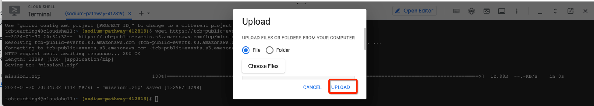

<h1 align="center">Mission 1</h1>

<h2 align="center">Steps to implement Hands-on Project</h2>

<h3 align="center">Attention: use the video below as a technical summary to speed up the implementation of part 1 of the project</h3>


[](https://file.notion.so/f/f/0d1b678b-cd91-4256-93c7-73b2e82396d5/9be3ea9d-c1d6-41a0-8008-89a946a53569/ICP_EN_MISSAO1_COMPLEMENTO.mp4?id=12de7d98-de92-41b9-9aec-59a4820c844e&amp;table=block&amp;spaceId=0d1b678b-cd91-4256-93c7-73b2e82396d5&amp;expirationTimestamp=1706767200000&amp;signature=CJtYUWu5JoXZiEUd0jMLm1288Caz3sklGgZz9m0sqF4)

<h2 align="center">Steps in Amazon Web Services (AWS)</h2>

### Creating the terraform-en-1 user using the IAM service
- Access the AWS console ([https://aws.amazon.com](https://aws.amazon.com/)) **and log in with your newly created account**. In the search bar, type IAM. In the Services section, click on IAM.
- Click on Users and then Add users, enter the name **terraform-en-1** and click Next to create a programmatic type user.

<p align="center">
  
</p>

- After advancing, in **Set permissions**, click on the Attach existing policies directly button.

<p align="center">
  
</p>

- Type **AmazonS3FullAccess** in Search.
- Select **AmazonS3FullAccess**

<p align="center">
  
</p>

- Click on **Next**
- Review all the details
- Click on **Create user**

### Creating the Access Key for the terraform-en-1 user using the IAM service

- Access the **terraform-en-1** user

<p align="center">
  
</p>

- Click on the **Security credentials** tab

<p align="center">
  
</p>

- Navigate to the **Access keys** section
- Click on **Create access key**

<p align="center">
  
</p>

- Select Command Line Interface (CLI) and **I understand the above recommendation and want to proceed to create an access key**.

<p align="center">
  
</p>

- Click on **Next**.
- Click on **Create access key**

<p align="center">
  
</p>

- Click on **Download .csv file**

<p align="center">
  
</p>

- After the download finishes, click on Done.
- Once the download is complete, rename the **.csv** file to **key.csv**

<h2 align="center">Steps in Google Cloud Platform (GCP)</h2>

### Preparing the environment to run Terraform
- Access the Google Cloud Console ([console.cloud.google.com](http://console.cloud.google.com/)) **and log in with your newly created account**
- Open the Cloud Shell

<p align="center">
  
</p>
<p align="center">
  
</p>

- Download the `mission1.zip` file in the Google Cloud shell using the wget command
```sh
wget https://tcb-public-events.s3.amazonaws.com/icp/mission1.zip
```
    Result

<p align="center">
  
</p>

- Upload the `key.csv` file to the Cloud Shell using the browser

  **Step 1**

<p align="center">
  
</p>

  **Step 2**

<p align="center">
  
</p>

  **Step 3**

<p align="center">
  
</p>

- Verify if the `mission1.zip` and `key.csv` files are in the folder in the Cloud Shell using the command below

```json
ls
```

  **Result**

<p align="center">
  
</p>

- Execute the file preparation commands:

```
unzip mission1.zip
```
```
mv key.csv mission1/en
```
```
cd mission1/en
```
```
chmod +x *.sh
```
  **Result**

<p align="center">
  
</p>

- Execute the commands below to prepare the AWS and GCP environment

```
mkdir -p ~/.aws/
```
```
touch ~/.aws/credentials_multiclouddeploy
```
```
./aws_set_credentials.sh key.csv
```
```
GOOGLE_CLOUD_PROJECT_ID=$(gcloud config get-value project)
```
```
gcloud config set project $GOOGLE_CLOUD_PROJECT_ID
```

- Click on Authorize

<p align="center">
  
</p>

- Execute the command below to set the project in the Google Cloud Shell

```
./gcp_set_project.sh
```

- Execute the commands to enable the Kubernetes, Container Registry, and Cloud SQL APIs

```
gcloud services enable containerregistry.googleapis.com
```

```
gcloud services enable container.googleapis.com
```

```
gcloud services enable sqladmin.googleapis.com
```

```
gcloud services enable cloudresourcemanager.googleapis.com
```

```
gcloud services enable servicenetworking.googleapis.com --project=$GOOGLE_CLOUD_PROJECT_ID
```

### Running Terraform to provision MultiCloud infrastructure in AWS and Google Cloud
- Execute the following commands to provision infrastructure resources
```
cd ~/mission1/en/terraform/
```

```
terraform init
```

```
terraform plan
```

```
terraform apply
```

**Attention**: The provisioning process can take between **15 to 25 minutes** to finish. Keep the **CloudShell** open during the process. If disconnected, click on **Reconnect** when the session expires (the session expires after **5 minutes** of inactivity by default)

### Security Tips
- For production environments, it's recommended to use only the Private Network for database access.
- Never provide public network access (0.0.0.0/0) to production databases. ⚠️

**By reaching this point, you have completed the implementation of the first part of the Hands-on Project and have implemented resources in a MultiCloud (AWS and Google Cloud) environment using Terraform!**

**Congratulations! 🚀🎉**
