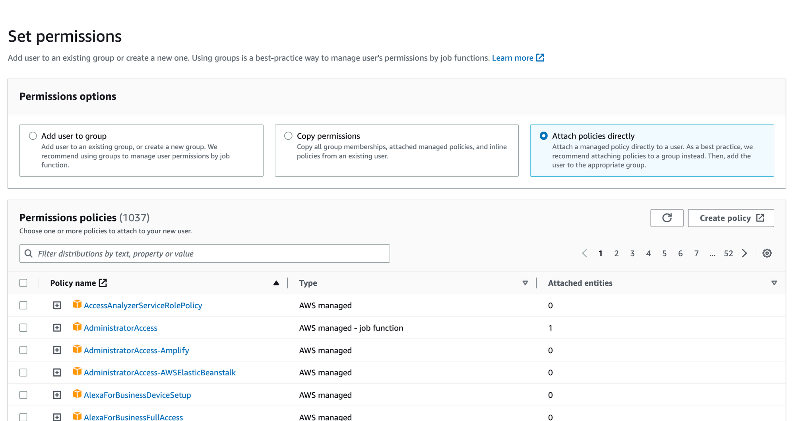
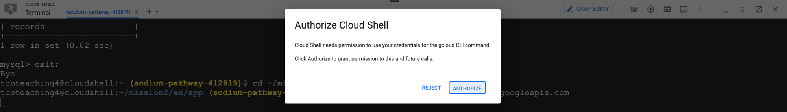
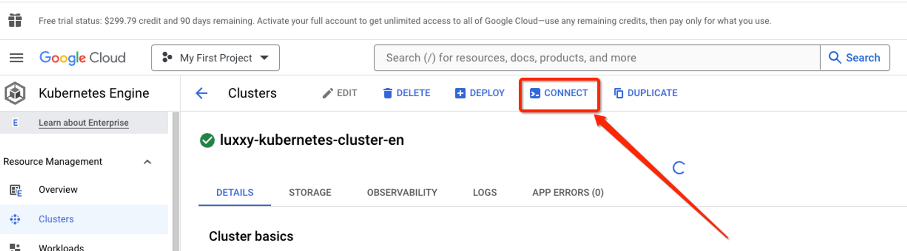

<h1 align="center">Mission 2</h1>

<h2 align="center">Steps in Amazon Web Services (AWS)</h2>

### Creating the terraform-en-1 user using the IAM service
- Access AWS console and go to IAM service
- Under Access management, Click in "Users", then "Add users". Insert the User name luxxy-covid-testing-system-en-app1 and click in Next to create a programmatic user.

<p align="center">
  
</p>

- On Set permissions, Permissions options, click in "Attach policies directly" button.

<p align="center">
  
</p>

- Type **AmazonS3FullAccess** in Search.
- Select **AmazonS3FullAccess**

<p align="center">
  
</p>

- Click on **Next**
- Review all the details click Create user

<p align="center">
  
</p>

### Steps to create access key:

- Click on the user you have created.
- Go to Security credentials tab.
- Scroll down and go to Access keys section.
- Click on Create access key

<p align="center">
  
</p>

- Select **Command Line Interface (CLI)** and **I understand the above recommendation and want to proceed to create an access key** checkbox.
- Click Next
- Click on Create access key
- Click on Download .csv file
- After download, click Done.
- Now, rename .csv file downloaded to **luxxy-covid-testing-system-en-app1.csv**

<h2 align="center">Steps in Google Cloud Platform (GCP)</h2>

- Navigate to Cloud SQL instance and create a new user **app** with password **welcome123456** on Cloud SQL MySQL database

- Connect to Google Cloud Shell
- **Download** the mission2 files to Google Cloud Shell using the `wget command as shown below`

    ```
    cd ~
    ```

    ```
    wget https://tcb-public-events.s3.amazonaws.com/icp/mission2.zip
    ```

    ```
    unzip mission2.zip
    ```

- Connect to MySQL DB running on Cloud SQL (once it prompts for the password, provide **welcome123456**). **Don’t forget to replace the placeholder with your Cloud SQL Public IP**

<p align="center">
  
</p>

```
mysql --host=<replace_with_public_ip_cloudsql> --port=3306 -u app -p
```

- Once you're connected to the database instance, create the products table for testing purposes

    ```
    use dbcovidtesting;
    ```

    ```
    source ~/mission2/en/db/create_table.sql
    ```

    ```
    show tables;
    ```

    ```
    exit;
    ```

- Enable Cloud Build API via Cloud Shell.

    ```
    gcloud services enable cloudbuild.googleapis.com
    ```

<p align="center">
  
</p>

- Build the Docker image and push it to Google Container Registry.

    ```
    GOOGLE_CLOUD_PROJECT_ID=$(gcloud config get-value project)
    ```

    ```
    cd ~/mission2/en/app
    ```

    ```
    gcloud builds submit --tag gcr.io/$GOOGLE_CLOUD_PROJECT_ID/luxxy-covid-testing-system-app-en
    ```

- Open the Cloud Editor and edit the Kubernetes deployment file (**luxxy-covid-testing-system.yaml**) and update the variables below on **line 33** in **red** with your <PROJECT_ID> on the Google Container Registry path, on **line 42** AWS Bucket name, AWS Keys (open file l**uxxy-covid-testing-system-en-app1.csv** and use **Access key ID** on **line 44** and **Secret access key** on **line 46**)  and Cloud SQL Database Private IP on **line 48**.

    ```
    cd ~/mission2/en/kubernetes
    luxxy-covid-testing-system.yaml

    				image: gcr.io/<PROJECT_ID>/luxxy-covid-testing-system-app-en:latest
    ...
    				- name: AWS_BUCKET
              value: "luxxy-covid-testing-system-pdf-en-xxxx"
            - name: S3_ACCESS_KEY
              value: "xxxxxxxxxxxxxxxxxxxxx"
            - name: S3_SECRET_ACCESS_KEY
              value: "xxxxxxxxxxxxxxxxxxxx"
            - name: DB_HOST_NAME
              value: "172.21.0.3"
    ```

- Connect to the GKE (Google Kubernetes Engine) cluster via Console

    **Step 1**

<p align="center">
  
</p>

**Step 2**

<p align="center">
  
</p>

- Deploy the application Luxxy in the Cluster

    ```
    cd ~/mission2/en/kubernetes
    ```

    ```
    kubectl apply -f luxxy-covid-testing-system.yaml
    ```

- Under **GKE** > **Workloads** > **Exposing Services**, get the application Public IP

    **Step 1**

<p align="center">
  
</p>

  **Step 2**

<p align="center">
  
</p>

- You should see the app up & running!

<p align="center">
  
</p>

**Congratulations for finishing the hands-on project part 2! 🚀🎉**
