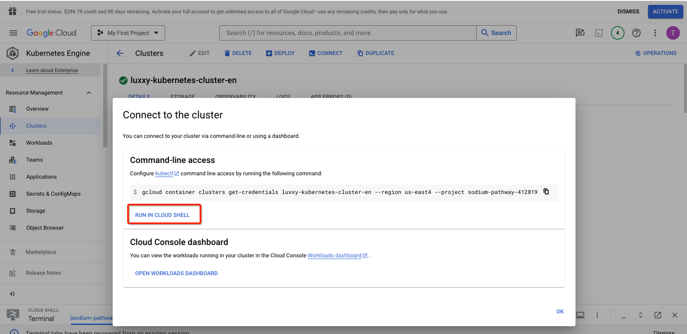

<h1 align="center">Mission 3</h1>

<h2 align="center">Steps in Google Cloud Platform (Database Migration)</h2>

- Connect to Google Cloud Shell
- **Download** the dump `using wget`

```
cd ~
```

```
wget https://tcb-public-events.s3.amazonaws.com/icp/mission3.zip
```

```
unzip mission3.zip
```

- Connect to MySQL DB running on Cloud SQL (once it prompts for the password, provide **welcome123456**). **Don’t forget to replace the placeholder with your Cloud SQL Public IP**

```
mysql --host=<replace_with_public_ip_cloudsql> --port=3306 -u app -p
```

- Import the dump on Cloud SQL

```
use dbcovidtesting;
```

```
source ~/mission3/en/db/db_dump.sql
```

- Check if the data got imported correctly

```
select * from records;
```

```
exit;
```

<h2 align="center">Steps in Amazon Web Services (PDF Files Migration)</h2>

- Connect to the AWS Cloud Shell
- Download the PDF files

```
wget https://tcb-public-events.s3.amazonaws.com/icp/mission3.zip
```

```
unzip mission3.zip
```

- Sync PDF Files with your AWS S3 used for COVID-19 Testing Status System. **Replace the bucket name with yours.**

```
cd mission3/en/pdf_files
```

```
aws s3 sync . s3://luxxy-covid-testing-system-pdf-en-xxxx
```

- Test the application. Upon migrating the data and files, you should be able to see the entries  under “View Guest Results” page.

<p align="center">
  
</p>

**Congratulations! You have migrated an "on-premises" application & database to a MultiCloud Architecture!**

<h2 align="center">Appendix I - Destroying the environment permanently</h2>

After completing the hands-on project and gathering the implementation evidence, follow the step-by-step instructions below to remove the entire MultiCloud environment.

### [Google Cloud] Delete Kubernetes resources

**Step 1**

<p align="center">
  
</p>

**Step 2**

<p align="center">
  
</p>

```
kubectl delete deployment luxxy-covid-testing-system
```
​
```
kubectl delete service luxxy-covid-testing-system
```
​
### [Google Cloud] Delete VPC Peering

<p align="center">
  
</p>

### [AWS] Delete files inside of S3

<p align="center">
  
</p>

### [Google Cloud] Delete remaining resources w/ Terraform - Cloud Shell

```
cd ~/mission1/en/terraform/
```
​
```
terraform destroy
```
​
### Clean the Cloud Shell in AWS and Google Cloud

### AWS

```
cd ~
```
​
```
rm -rf mission*
```
​
### Google Cloud

```
cd ~
```
​
```
rm -rf mission*
```
​
```
rm -rf .ssh
```
